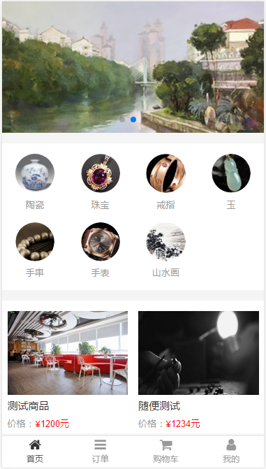
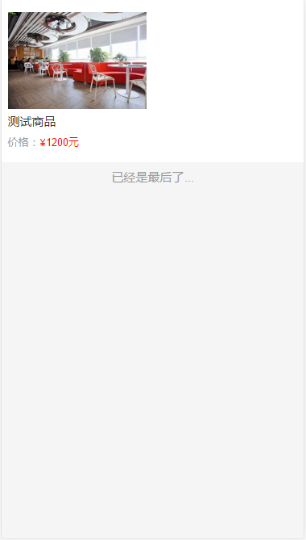
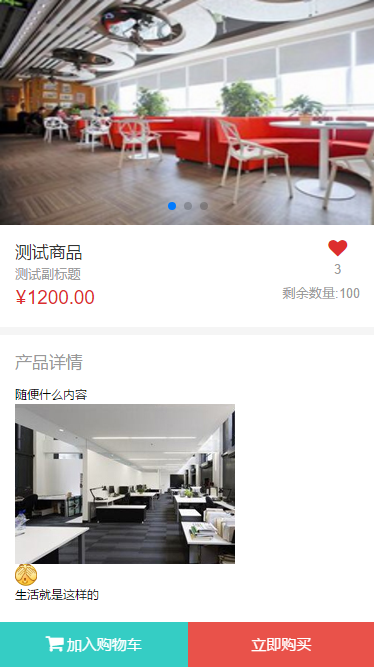
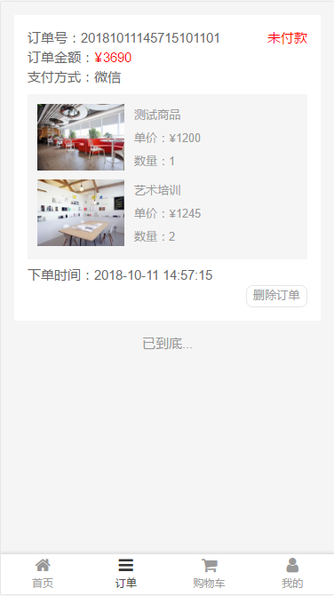
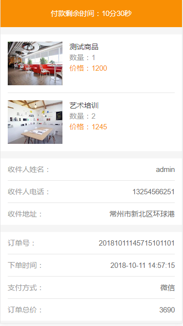
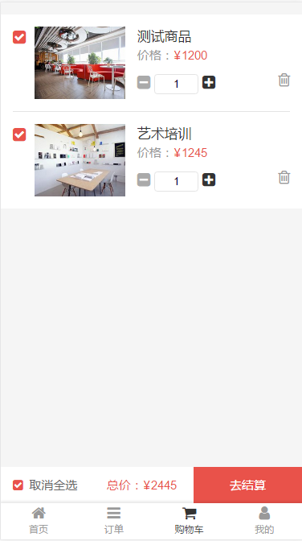
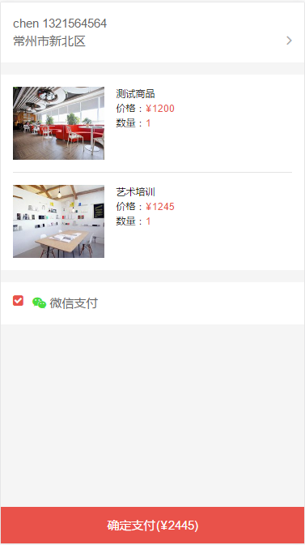

# vue_mall

> vue 写的简约（部分功能没有）,纯属是配合node写的后台的<br/><br/>

> Node项目地址 https://github.com/benchenchuang/myMall

## 首页 （轮播+分类导航+推荐+整站导航）
 
## 分类产品列表
 
## 产品详情（点赞+加购物车+直接购买）
 
## 订单列表
 
## 订单详情（订单详细内容+15分钟未付款取消订单）
 
## 购物车（全选 单选等）
 
## 下单页面
 

## Build Setup

``` bash
# install dependencies
npm install

# serve with hot reload at localhost:8080
npm run dev

# build for production with minification
npm run build

# build for production and view the bundle analyzer report
npm run build --report
```

For a detailed explanation on how things work, check out the [guide](http://vuejs-templates.github.io/webpack/) and [docs for vue-loader](http://vuejs.github.io/vue-loader).
